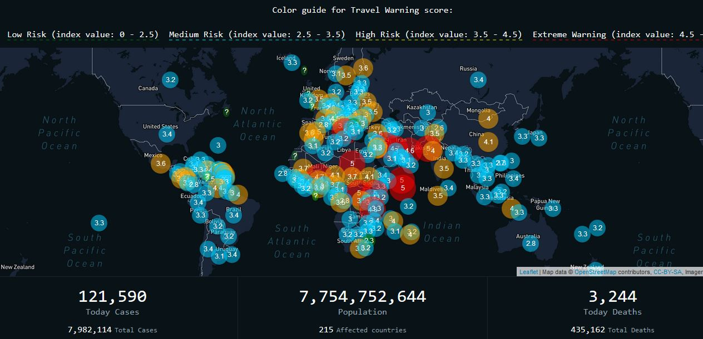
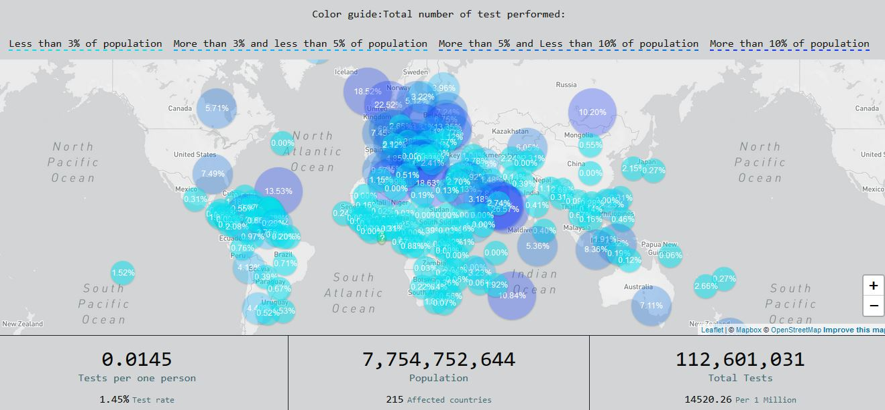
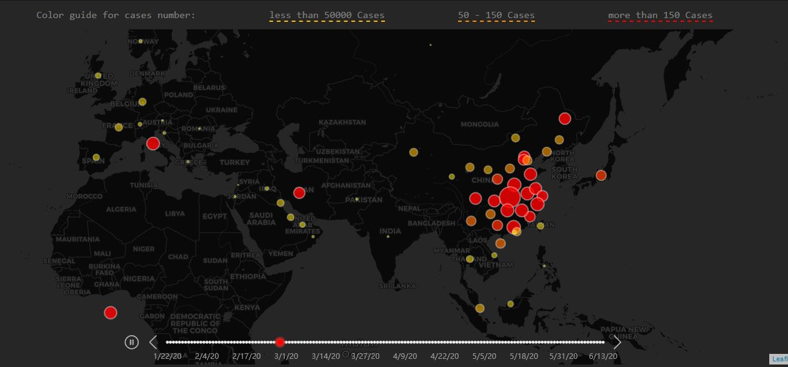
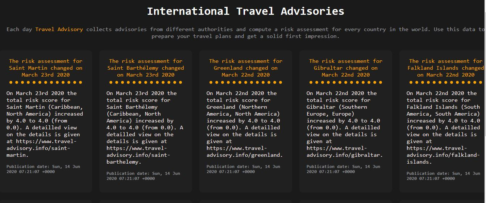
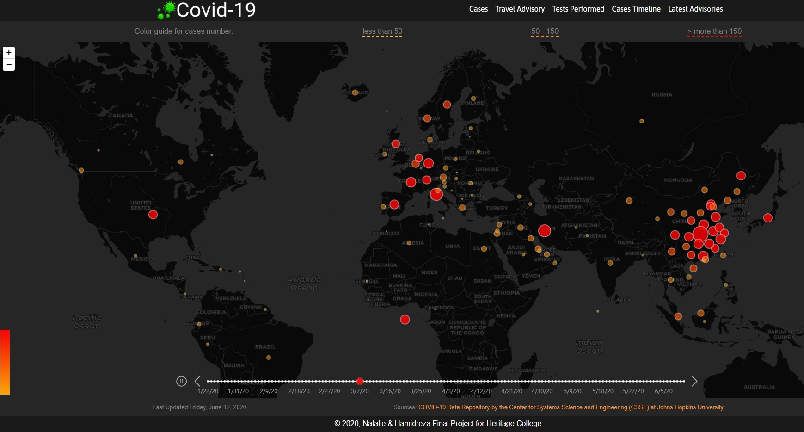

# 🔆✈️Coronavirus Statistics and Travel Advice Map Project 
## Version 2.0

Due the COVID-19 virus situation, Many countries issue travel advisories about other countries. Tailored to the citizens of the issueing country, they may be a little biased at times.
To provide a consolidated and more neutral view, CORONA Map Application, using https://travel-advisory.info and https://corona.lmao.ninja/ resources aggregate the travel advisories from many authorities, normalize them and create a comparable scoring. This and the sources help you, to get a more comprehensive impression for better trip planning.

This application is a developed version of Coronavirus Application Version 1.0,  which has more features for users. We are trying to gather the most essential information using latest updates on this subject and present them in a graphical and user-friendly way to all potential users.

COVID-19 V 2.0, is a map-based application which has five pages, first page(Cases), using  external webservice (travel-advisory) to show updated confirmed COVID-19 cases aslo deaths and recovered cases for each country, the second page(Travel Score) , shows  the Global Travel Risk Map , using external web servises to indicate the risk of travele to the disired country.
Test page, shows total number of test performed by each country, the Case Timeline page shows how and at what speed the COVI-19, has spread around the word. The last page provides  latest news and update to the user.

-Total Cases Page:


-Travel Advisory Page:


-Test Performed Page:


-Cases Timeline Page:


-Latest News Page:



* [Yarn](https://yarnpkg.com/en/)
* [Gatsby](https://www.gatsbyjs.org/)
* [Sass](https://sass-lang.com)
* [React Helmet](https://github.com/nfl/react-helmet)
* [Resolve Src](https://github.com/alampros/gatsby-plugin-resolve-src)
* [Leaflet](https://leafletjs.com/)
* [React Leaflet](https://react-leaflet.js.org)

## 🚀🚀🚀 Getting Started

### Requirements
* [Gatsby CLI](https://www.npmjs.com/package/gatsby-cli)
* [Yarn](https://yarnpkg.com/en/)

### Quick Start
/Check to run next commands from project folder/
After cloning the project into your directory, run the following in your terminal
```
yarn install
```
```
yarn develop
```

### Starting from Scratch
*Run Windows powershell as administrator to run the commands.
* Set up Yarn: https://yarnpkg.com/lang/en/docs/install/#mac-stable)[https://yarnpkg.com/lang/en/docs/install/
* Install the Gatsby CLI globally:
```
yarn global add gatsby-cli
```
* Inside the directory of your choice, clone the project:
```
git clone https://github.com/nataliereshetnikova/corona-map.git
```
* Install all the packages from json file:
```
yarn install
```
* Navigate to your new directory and run:
```
run the following command in your terminal
yarn develop
```
* You should now be running project locally! 🎉

